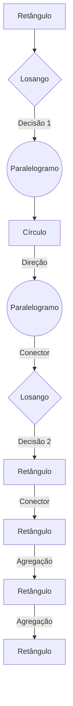

<!-- BASE INICIAL PARA FLOWS DE PROJETO -->

```mermaid

graph TD;
    A[Retângulo] --> B{Losango};
    B -->|Decisão 1| C((Paralelogramo));
    C --> D[Círculo];
    D -->|Direção| E((Paralelogramo));
    E -->|Conector| F{Losango};
    F -->|Decisão 2| G[Retângulo];
    G -->|Conector| H[Retângulo];
    H -->|Agregação| I[Retângulo];
    I -->|Agregação| J[Retângulo];

```